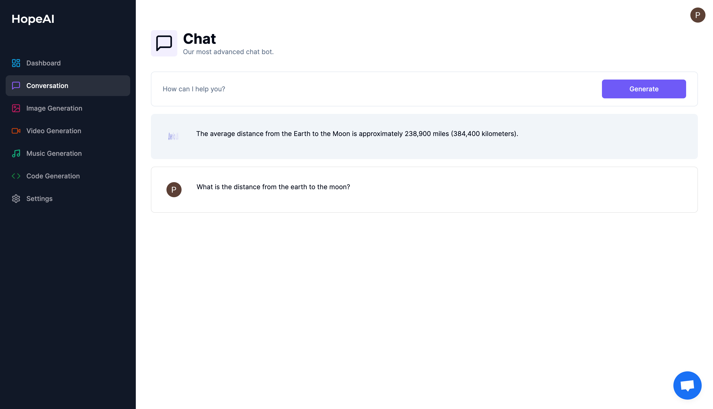

# AI-SaaS || Built with NextJs and Payment gateway - Stripe.

<div align="center">
  
  &nbsp;&nbsp;

</div>

# Deploy in **VERCEL**  <a href="https://hope-ai.vercel.app/" target="_blank" target="_blank" title="HopeAI-SaaS" >Click Here!</a> 

# Quick Overview - Setup & Run

#### Step - 1

Download or Clone

```sh
git clone https://github.com/pariweshtamr/ai-saas.git
```

#### Step - 2

```bash
cd ai-saas
```

#### Step - 4

```bash
npm i
#or
npm install
#or
yarn add
```

#### Step - 5

create `.env` file from `.env.example` need [Stripe](https://stripe.com/), [Clerk](https://clerk.com/), [OpenAI](https://openai.com/), [Replicate](https://replicate.com/) & [Crisp](https://crisp.chat/en/)

- NEXT_PUBLIC_CLERK_SIGN_IN_URL=/signin
- NEXT_PUBLIC_CLERK_SIGN_UP_URL=/sign-up
- NEXT_PUBLIC_CLERK_AFTER_SIGN_IN_URL=/dashboard
- NEXT_PUBLIC_CLERK_AFTER_SIGN_UP_URL=/dashboard
- NEXT_PUBLIC_CLERK_PUBLISHABLE_KEY
- CLERK_SECRET_KEY
- OPENAI_API_KEY
- REPLICATE_API_TOKEN
- STRIPE_API_SECRET_KEY
- NEXT_PUBLIC_APP_URL
- STRIPE_WEBHOOK_SECRET
- CRISP_WEBSITE_ID
- DATABASE_URL

#### Step - 6

Build & Run the project

First, run the development server:

```bash
npm run dev
#or
yarn dev
```

Open [http://localhost:3000](http://localhost:3000) with your browser to see the result.

# Screenshot

## #Landing page


## #Dashboard


## #Chat page



## #Settings page with Chatbot


